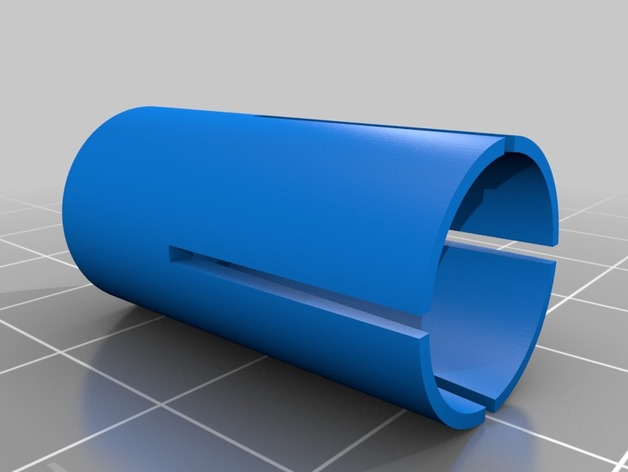
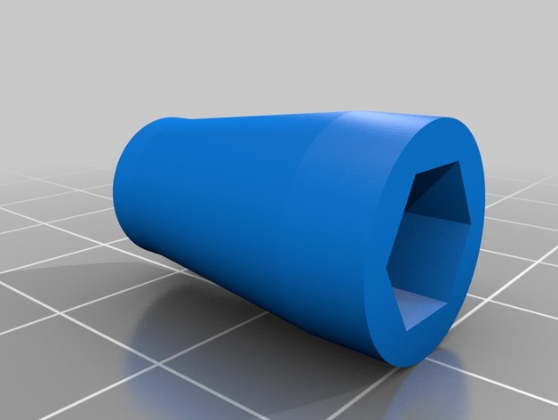

https://www.thingiverse.com/thing:3025992
Bar end mirror mounting by amonroy_uy is licensed under the Creative Commons - Attribution - Non-Commercial license.
http://creativecommons.org/licenses/by-nc/3.0/

# Summary

Bar ends mounting. 
External diameter: 14mm
Internal: M8x1.25 thread

I created these to mount some bard end mirrors into a narrow handlebar of a motorcycle that has an internal diameter of approximately 14mm.

It works the same way as the metal ones: one piece is expandable, the other one is conic+threaded. When you screw the bolt in there, the expandable piece pushes towards the interior of the handlebar, so it gets fixed in place.

You will need a M8x1.25 bolt.

## Print Settings

Rafts: Doesn't Matter
Supports: No
Infill: 30%

Notes: 
0.1 layer height

