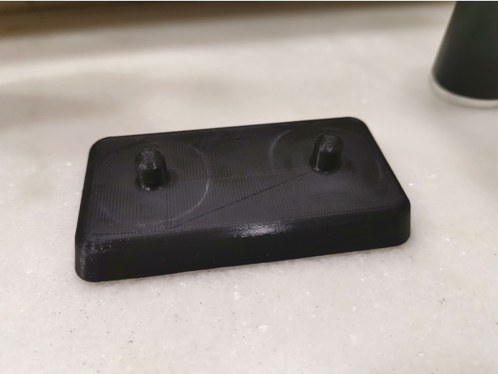

http://www.thingiverse.com/thing:3639380
Electric toothbrush stand by amonroy_uy is licensed under the Creative Commons - Attribution - Non-Commercial license.
http://creativecommons.org/licenses/by-nc/3.0/

# Summary

This is inspired by the Aquasonic Black Series electric toothbrush charger. You may use it for any toothbrush as long as the base has a hole with a diameter of at least 8mm and as depth as at least 8mm as well. 

No support needed.

