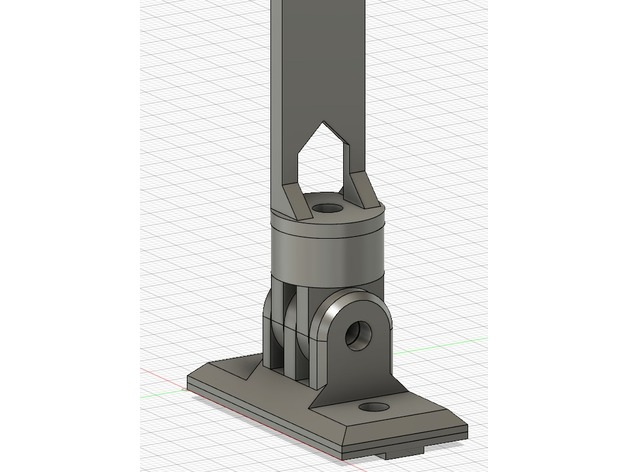

http://www.thingiverse.com/thing:3485643
Led strip mount to 2020 by amonroy_uy is licensed under the Creative Commons - Attribution - Non-Commercial license.
http://creativecommons.org/licenses/by-nc/3.0/

# Summary
You need:
- 1x M4x20mm bolt plus nut (or M3)
- 1x M4x8mm bolt
- 2x T-nuts for 2020 

There's an optional STL file for better mounting on the 2020 extrusion. 

Various lengths available: 10cm, 12cm, 15cm, 18cm and 20cm.

## Print Settings
No supports needed