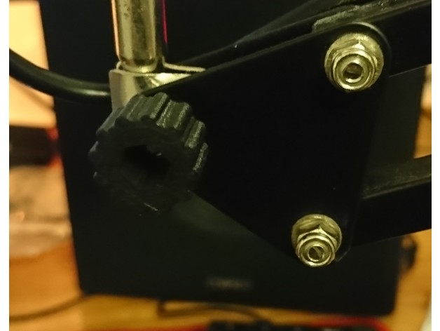

https://www.thingiverse.com/thing:3042383
Mic stand knob (M3 nut) by amonroy_uy is licensed under the Creative Commons - Attribution - Non-Commercial license.
http://creativecommons.org/licenses/by-nc/3.0/

# Summary
My mic stand adjusting knob broke, so I 3d printed a replacement for it. 
This works for any mic stand with a 3mm bolt. 
You will need a nut to use it!

