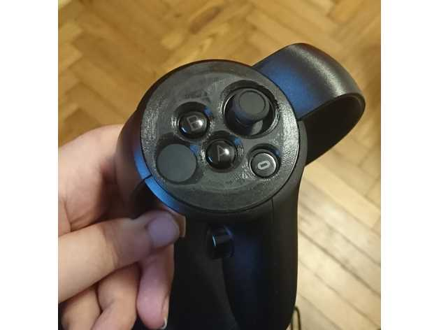

https://www.thingiverse.com/thing:3030557
Oculus Touch buttons bumps / cover by amonroy_uy is licensed under the Creative Commons - Attribution - Non-Commercial license.
http://creativecommons.org/licenses/by-nc/3.0/

# Summary
I created this based on https://www.thingiverse.com/thing:2680261. I have low sensitivity in my left hand fingers, so this helps me finding the buttons easier. Also, this prevents me from pressing the home button by mistake.
Left and right hand are mirrored. I uploaded both just in case.

You will find 2 versions: one with all buttons available, and one with a cap for the home button.

## Print Settings
Rafts: Doesn't Matter
Supports: No

Notes: 
You should print this with the best quality so it would be softer. Sanding will help.