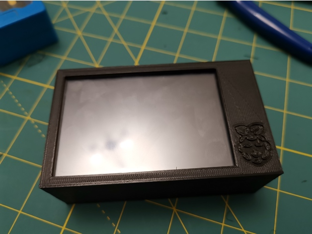

http://www.thingiverse.com/thing:3657517
RasPi + 3.5 inch screen case by amonroy_uy is licensed under the Creative Commons - Attribution - Non-Commercial license.
http://creativecommons.org/licenses/by-nc/3.0/

# Summary
Screen used is KeDei 3.5 inch LCD TFT 320x480 touch screen (sample link https://www.aliexpress.com/item/New-Original-3-5-Inch-LCD-TFT-Touch-Screen-Display-for-Raspberry-Pi-2-Raspberry-Pi/32851565266.html).

You will need:
- The screen (KeDei 3.5 inch LCD TFT 320x480 touch screen)
- Raspberry Pi 3 (or 3+)
- 2xM2.5 screws
- 2xM3 screws
- [If the screen is wobbly] Hot glue or any kind of soft adhesive

