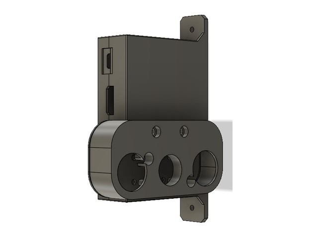

https://www.thingiverse.com/thing:3033563
Raspberry + cam + infrared leds side mount on 2020 by amonroy_uy is licensed under the Creative Commons - Attribution - Non-Commercial license.
http://creativecommons.org/licenses/by-nc/3.0/

# Summary

I created this so I could mount my OctoPi setup into my Anycubic Kossel printer. The idea is that it's mounted on one of the 2020 vertical extrusions. 

Used for this setup:
- Raspberry Pi 3 B plus (non plus should fit as well)
- Wide screen camera with infrared lights (bought from china)
- 2 mounting nuts and bolts for the 2020 profile (the hole in the case is for a 3mm screw, but you can manage to enlarge it if have bigger bolts)
- For mounting the camera: 2 x M3*20mm bolt + 2 x M3 nut (smaller ones would work, but you need the bolts to be 20mm in length)
- For mounting the raspberry case: 4 x M2.5*6mm (at least that length), no nuts required

## Print Settings

Resolution: 0.1mm
Infill: 10%

Notes: 
The fitting is thight. There is a very thin wall in the raspberry cover, you may need to select "Print thin walls" in Cura (check out using layer view).