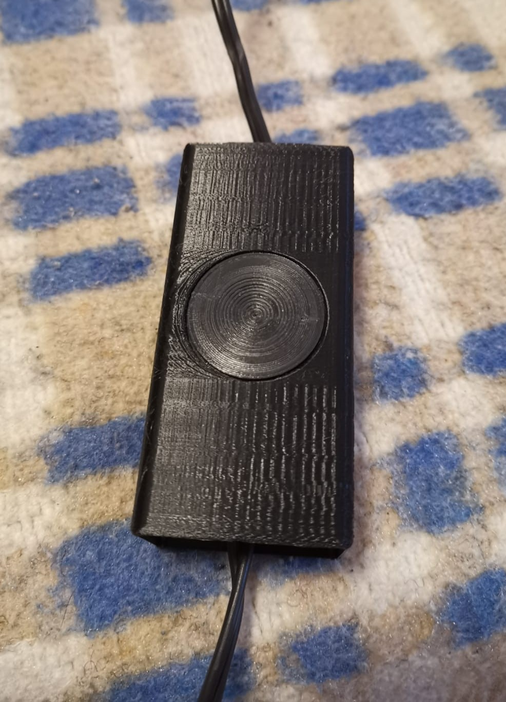

# Summary
Similar to a Shelly button, this Sonoff case for a Sonoff Basic creates a switch for a lamp or whatever.
No screws needed.

## Print Settings
Notes: Use concentric roof for the cyrcle button.
