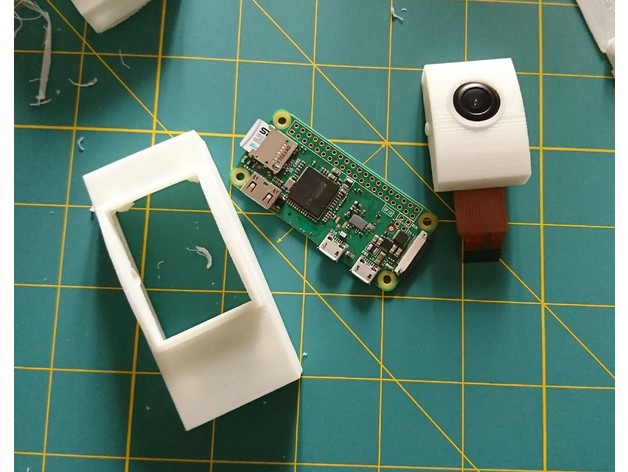
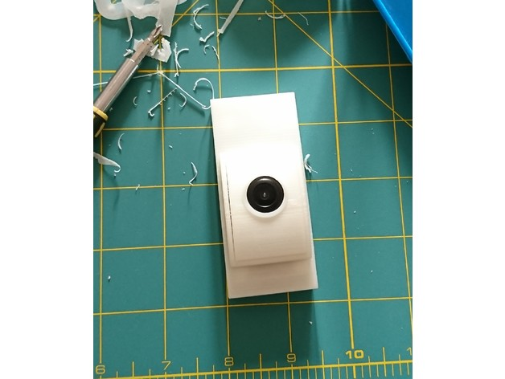

https://www.thingiverse.com/thing:3064417
Zero W security cam by amonroy_uy is licensed under the Creative Commons - Attribution - Non-Commercial license.
http://creativecommons.org/licenses/by-nc/3.0/

# Summary
Raspy Zero W security cam with vertical adjustment

What's needed:
- Raspberry Pi Zero W (plus microSD card and micro usb charger)
- Wide angle camera (130 degrees), with ribbon cable and M2 screws (I specifically used this: https://www.aliexpress.com/item/giantree-Zooming-Focus-Fisheyes-Wide-Angle-Night-Vision-Cams-5-million-pixels-130-degreesFor-Raspberry-Pi2/32831397359.html - Raspberry Fisheye Wide Angle 130 degrees Camera-; different cameras have different dimensions, so make sure to check that out) 
- 4 x M2.5 screws

Software suggested:
- motionEyeOS (there are a lot of guides out there)

## Print Settings
I suggest printing flat surfaces facing bottom and using concentric support so you will get the best finish (camera and raspberry cases with the open end to bottom as the other one is curved).